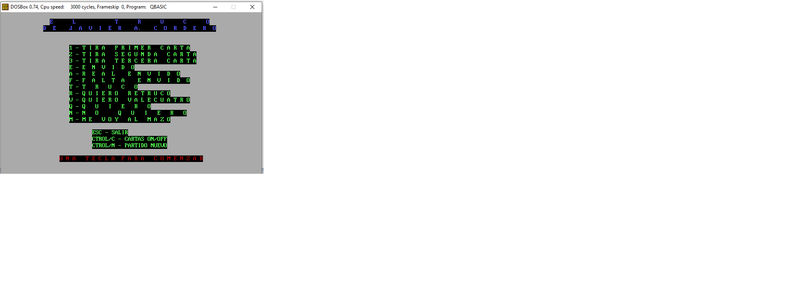
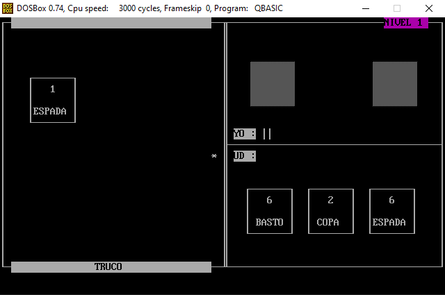
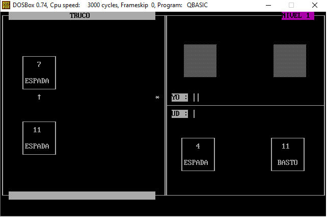

# El Truco - QBasic (1992)

*[Leer en Espanol](README.md)*

Argentine Truco card game written in QBasic by **Javier A. Cordero**, at the age of 16, on a 286 PC with a Sound Blaster card.

**[Play in the browser](https://jacinside.github.io/truco-qbasic-1992/)**


## Screenshots

| Title screen | In-game | Truco called |
|---|---|---|
|  |  |  |

## About the game

A complete Argentine Truco card game against the computer, featuring:

- **Artificial intelligence** that evaluates card strength, strategically decides which card to play, and uses randomness to remain unpredictable
- **Real voice recordings** captured with a microphone and Sound Blaster card - the voices of the author and his brothers
- **All betting moves**: envido, real envido, falta envido, truco, retruco, quiero vale cuatro, me voy al mazo
- **Liar detection**: if you lie about your envido points, the computer catches you, insults you, and takes your points away
- **High score table** with disk persistence
- **Level system** with progressive difficulty
- **3 characters** with different voices (JAC, GAC, MFC)
- **Background music** using MIDI files
- **Ambient sound effects** (phone, horn, doorbell, applause, laughter...)

## Historical context

This game was created around 1992 in Argentina, in an era without internet, without Stack Overflow, without online tutorials. The only motivation was for the family to play and have fun. The game's AI implements probabilistic bluffing, adaptive strategy based on the score, and complete handling of all Argentine Truco rules - all written by a 16-year-old in QBasic.

The voices were recorded by the author and his brothers using a Sound Blaster microphone, in Creative Labs VOC format.

## How to play

### Requirements

- [DOSBox](https://www.dosbox.com/) (recommended) or DOSBox-X

### Quick start

On Windows, create a shortcut or .bat file with:

```
"C:\Program Files (x86)\DOSBox-0.74\DOSBox.exe" -c "mount c ." -c "c:" -c "QBASIC /MBF /RUN TRUCO.BAS"
```

Or open DOSBox manually and type:

```
mount c <path-to-game-folder>
c:
QBASIC /MBF /RUN TRUCO.BAS
```

### Controls

| Key | Action |
|-----|--------|
| 1 | Play first card |
| 2 | Play second card |
| 3 | Play third card |
| E | Envido |
| A | Real envido |
| F | Falta envido |
| T | Truco |
| R | Quiero retruco |
| V | Quiero vale cuatro |
| Q | Quiero (accept) |
| N | No quiero (decline) |
| M | Me voy al mazo (fold) |
| ESC | Quit |
| CTRL+N | New game |

## Project structure

```
TRUCO.BAS       - Main source code (~790 lines of QBasic)
TRUCO.BAR       - Earlier version of the code (backup)
CANTOS/         - Voice files (.VOC) recorded by the family
*.BAT           - Scripts to play sounds via SBPLAY
*.MID / *.CMF   - Background music
QBASIC.EXE      - MS-DOS QBasic interpreter
SBPLAY.EXE      - Sound Blaster audio player
LISTA           - High score table (top 10)
```

## Technical highlights

- **Card hierarchy**: Correct implementation of Argentine Truco card ranking (1 espada > 1 basto > 7 espada > 7 oro > 3 > 2 > 12 > 11 > 7 > 6 > 5 > 4)
- **Envido calculation**: Handles all cases (two of the same suit, three of the same suit, lone card)
- **Strategic AI**: The computer sorts its cards by strength, decides which to play based on the situation, and varies aggression with the score
- **Bluffing**: The AI probabilistically decides whether to call envido, raise the bet, or fold, with thresholds that change based on context

## License

MIT License - Copyright (c) 1992 Javier A. Cordero. See [LICENSE](LICENSE).
